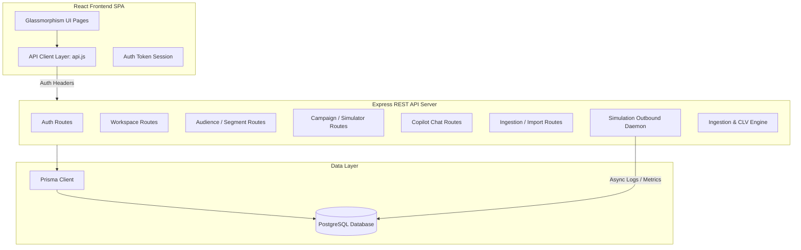

# Xeno AI Campaign Console: Backend Specification & Frontend Integration Guide

This specification document serves as the blueprints and comprehensive instruction guide for creating a fully functional, production-ready backend for the **Xeno AI Campaign Console**, and integrating it with the existing React frontend. 

The goal is to transition the frontend from its current client-side stateful simulation (which uses `mockData.js` and `localStorage` persistence) into a live, database-backed SaaS application powered by **Express.js**, **Prisma ORM**, and **PostgreSQL**.

---

## 🏗️ System Architecture Overview

The system consists of:
1. **Frontend**: React SPA (Vite, Tailwind CSS, Recharts) that handles data visualization, onboarding workspace wizards, custom segments creation, campaign configuration, copilot chat, and live campaign simulations.
2. **Backend**: Express.js REST API server organizing logic around modular controllers, services, and repositories.
3. **Database**: PostgreSQL managed via Prisma ORM for relational schemas, strict isolation, and atomic transactional operations.
4. **Campaign Simulator Daemon**: A server-side simulation loop mimicking a live carrier message distribution gateway (delivering, clicking, and converting campaign dispatches in the background).
5. **AI Inference & Ingestion Agent**: A logic engine that handles customer dataset ingestions, recalculates metrics (LTV, Recency, Purchase Frequency), generates intelligent cohorts, and responds to natural language prompts in the chat.



---

## 🗄️ Database Schema (Prisma)

The backend schema requires strict relational integrity, support for multi-workspace isolation, background CSV ingestion states, and deep historical customer journey logs. Use the following schema in `src/prisma/schema.prisma`:

```prisma
generator client {
  provider = "prisma-client-js"
}

datasource db {
  provider = "postgresql"
  url      = env("DATABASE_URL")
}

model User {
  id                      String             @id @default(uuid()) @db.Uuid
  email                   String             @unique
  passwordHash            String
  firstName               String
  lastName                String
  avatarUrl               String?
  isEmailVerified         Boolean            @default(false)
  status                  UserStatus         @default(ACTIVE)
  role                    Role               @default(USER)
  deletedAt               DateTime?
  createdAt               DateTime           @default(now())
  updatedAt               DateTime           @updatedAt
  emailVerificationExpiry DateTime?
  emailVerificationToken  String?            @unique
  lastLoginAt             DateTime?
  lastLoginIp             String?
  passwordResetExpiry     DateTime?
  passwordResetToken      String?            @unique
  refreshTokenHash        String?            @unique
  sessionExpiry           DateTime?
  chatConversations       ChatConversation[]
  confirmedJobs           ImportJob[]        @relation("ConfirmedJobs")
  importJobs              ImportJob[]        @relation("UploadedJobs")
  createdSegments         Segment[]          @relation("CreatedSegments")
  memberships             WorkspaceMember[]

  @@map("users")
}

model Workspace {
  id                 String             @id @default(uuid()) @db.Uuid
  name               String
  slug               String             @unique
  description        String?
  createdAt          DateTime           @default(now())
  updatedAt          DateTime           @updatedAt
  campaignDeliveries CampaignDelivery[]
  campaigns          Campaign[]
  chatConversations  ChatConversation[]
  customers          Customer[]
  importJobs         ImportJob[]
  insights           Insight[]
  orders             Order[]
  segments           Segment[]
  memberships        WorkspaceMember[]

  @@map("workspaces")
}

model WorkspaceMember {
  id          String        @id @default(uuid()) @db.Uuid
  userId      String        @db.Uuid
  workspaceId String        @db.Uuid
  role        WorkspaceRole
  joinedAt    DateTime      @default(now())
  user        User          @relation(fields: [userId], references: [id], onDelete: Cascade)
  workspace   Workspace     @relation(fields: [workspaceId], references: [id], onDelete: Cascade)

  @@unique([userId, workspaceId])
  @@map("workspace_members")
}

model ImportJob {
  id                 String       @id @default(uuid()) @db.Uuid
  workspaceId        String       @db.Uuid
  uploadedBy         String       @db.Uuid
  type               String       @default("SALES_EXPORT")
  fileName           String
  status             ImportStatus @default(PENDING)
  totalRows          Int          @default(0)
  processedRows      Int          @default(0)
  successfulRows     Int          @default(0)
  failedRows         Int          @default(0)
  errorMessage       String?
  createdAt          DateTime     @default(now())
  completedAt        DateTime?
  confirmedAt        DateTime?
  confirmedBy        String?      @db.Uuid
  conflictSummary    Json?
  detectedMappings   Json?
  previewData        Json?
  resolutionStrategy String?
  confirmedByUser    User?        @relation("ConfirmedJobs", fields: [confirmedBy], references: [id])
  user               User         @relation("UploadedJobs", fields: [uploadedBy], references: [id], onDelete: Cascade)
  workspace          Workspace    @relation(fields: [workspaceId], references: [id], onDelete: Cascade)

  @@index([workspaceId])
  @@index([uploadedBy])
  @@index([status])
  @@index([createdAt])
  @@map("import_jobs")
}

model Customer {
  id          String             @id @default(uuid()) @db.Uuid
  workspaceId String             @db.Uuid
  externalId  String?
  firstName   String
  lastName    String?
  email       String?
  phone       String?
  gender      String?
  dateOfBirth DateTime?
  createdAt   DateTime           @default(now())
  updatedAt   DateTime           @updatedAt
  deletedAt   DateTime?
  city        String?
  deliveries  CampaignDelivery[]
  workspace   Workspace          @relation(fields: [workspaceId], references: [id], onDelete: Cascade)
  orders      Order[]

  @@unique([workspaceId, email])
  @@unique([workspaceId, phone])
  @@index([workspaceId])
  @@index([email])
  @@index([phone])
  @@map("customers")
}

model Order {
  id              String    @id @default(uuid()) @db.Uuid
  workspaceId     String    @db.Uuid
  customerId      String    @db.Uuid
  externalOrderId String?
  amount          Decimal   @db.Decimal(10, 2)
  currency        String    @default("INR")
  purchaseDate    DateTime
  createdAt       DateTime  @default(now())
  updatedAt       DateTime  @updatedAt
  category        String?
  discountUsage   Boolean   @default(false)
  customer        Customer  @relation(fields: [customerId], references: [id], onDelete: Cascade)
  workspace       Workspace @relation(fields: [workspaceId], references: [id], onDelete: Cascade)

  @@unique([workspaceId, externalOrderId])
  @@index([workspaceId])
  @@index([customerId])
  @@index([purchaseDate])
  @@map("orders")
}

model Segment {
  id          String        @id @default(uuid()) @db.Uuid
  workspaceId String        @db.Uuid
  name        String
  description String?
  createdBy   String        @db.Uuid
  createdAt   DateTime      @default(now())
  updatedAt   DateTime      @updatedAt
  campaigns   Campaign[]
  rules       SegmentRule[]
  user        User          @relation("CreatedSegments", fields: [createdBy], references: [id], onDelete: Cascade)
  workspace   Workspace     @relation(fields: [workspaceId], references: [id], onDelete: Cascade)

  @@index([workspaceId])
  @@index([createdBy])
  @@map("segments")
}

model SegmentRule {
  id        String  @id @default(uuid()) @db.Uuid
  segmentId String  @db.Uuid
  field     String
  operator  String
  value     String
  segment   Segment @relation(fields: [segmentId], references: [id], onDelete: Cascade)

  @@index([segmentId])
  @@map("segment_rules")
}

model Campaign {
  id             String             @id @default(uuid()) @db.Uuid
  workspaceId    String             @db.Uuid
  segmentId      String             @db.Uuid
  name           String
  channel        String
  messageSubject String?
  messageBody    String
  status         String             @default("DRAFT")
  sentCount      Int?
  openRate       Decimal?           @db.Decimal(5, 2)
  clickRate      Decimal?           @db.Decimal(5, 2)
  conversionRate Decimal?           @db.Decimal(5, 2)
  createdAt      DateTime           @default(now())
  updatedAt      DateTime           @updatedAt
  deliveries     CampaignDelivery[]
  segment        Segment            @relation(fields: [segmentId], references: [id], onDelete: Cascade)
  workspace      Workspace          @relation(fields: [workspaceId], references: [id], onDelete: Cascade)
  insights       Insight[]

  @@index([workspaceId])
  @@index([segmentId])
  @@map("campaigns")
}

model CampaignDelivery {
  id             String         @id @default(uuid()) @db.Uuid
  workspaceId    String         @db.Uuid
  campaignId     String         @db.Uuid
  customerId     String         @db.Uuid
  status         DeliveryStatus @default(SENT)
  messageSubject String?
  messageBody    String
  sentAt         DateTime       @default(now())
  updatedAt      DateTime       @updatedAt
  campaign       Campaign       @relation(fields: [campaignId], references: [id], onDelete: Cascade)
  customer       Customer       @relation(fields: [customerId], references: [id], onDelete: Cascade)
  workspace      Workspace      @relation(fields: [workspaceId], references: [id], onDelete: Cascade)

  @@index([workspaceId])
  @@index([campaignId])
  @@index([customerId])
  @@index([status])
  @@map("campaign_deliveries")
}

model Insight {
  id              String    @id @default(uuid()) @db.Uuid
  workspaceId     String    @db.Uuid
  campaignId      String?   @db.Uuid
  title           String
  description     String
  category        String
  evidence        String
  actionText      String
  suggestedPrompt String
  createdAt       DateTime  @default(now())
  campaign        Campaign? @relation(fields: [campaignId], references: [id], onDelete: Cascade)
  workspace       Workspace @relation(fields: [workspaceId], references: [id], onDelete: Cascade)

  @@index([workspaceId])
  @@index([campaignId])
  @@map("insights")
}

model ChatConversation {
  id          String        @id @default(uuid()) @db.Uuid
  workspaceId String        @db.Uuid
  userId      String        @db.Uuid
  title       String
  createdAt   DateTime      @default(now())
  updatedAt   DateTime      @updatedAt
  user        User          @relation(fields: [userId], references: [id], onDelete: Cascade)
  workspace   Workspace     @relation(fields: [workspaceId], references: [id], onDelete: Cascade)
  messages    ChatMessage[]

  @@index([workspaceId])
  @@index([userId])
  @@map("chat_conversations")
}

model ChatMessage {
  id             String           @id @default(uuid()) @db.Uuid
  conversationId String           @db.Uuid
  sender         String
  text           String
  data           Json?
  createdAt      DateTime         @default(now())
  conversation   ChatConversation @relation(fields: [conversationId], references: [id], onDelete: Cascade)

  @@index([conversationId])
  @@map("chat_messages")
}

enum Role {
  USER
  ADMIN
  SUPER_ADMIN
}

enum UserStatus {
  ACTIVE
  SUSPENDED
  DELETED
}

enum WorkspaceRole {
  OWNER
  ADMIN
  MEMBER
}

enum ImportStatus {
  PENDING
  PROCESSING
  COMPLETED
  FAILED
  PREVIEW_READY
  CONFIRMED
}

enum DeliveryStatus {
  SENT
  DELIVERED
  OPENED
  CLICKED
  CONVERTED
  FAILED
}
```

---

## 📡 REST API Specifications

The backend server exposes the REST router nested as shown below. All workspace-level operations must validate that the authenticated user has appropriate permissions in the `WorkspaceMember` table.

### 1. Authentication Router (`/api/v1/auth`)
*Note: Authenticated endpoints verify the `Authorization: Bearer <jwt_access_token>` header. Refresh routes require JWT token rotation validation.*

| Method | Endpoint | Description | Request Body Example | Success Response Example |
| :--- | :--- | :--- | :--- | :--- |
| **POST** | `/signup` | Create user and queue verification email | `{"email": "...", "password": "...", "firstName": "Sarah", "lastName": "Jenkins"}` | `{"success": true, "message": "Verification email dispatched."}` |
| **GET** | `/verify-email`| Confirm email verification token | Query parameters: `?token=verification_token_here` | `{"success": true, "accessToken": "jwt...", "refreshToken": "jwt...", "user": {...}}` |
| **POST** | `/login` | Authenticate user and issue tokens | `{"email": "...", "password": "..."}` | `{"success": true, "accessToken": "jwt...", "refreshToken": "jwt...", "user": {...}}` |
| **POST** | `/refresh` | Rotate access and refresh tokens | `{"refreshToken": "token..."}` | `{"success": true, "accessToken": "new...", "refreshToken": "new..."}` |
| **POST** | `/logout` | Revoke user refresh token hash | None | `{"success": true}` |
| **GET** | `/me` | Retrieve active authenticated user info | None | `{"success": true, "user": {"id": "...", "email": "...", "firstName": "...", "lastName": "...", "role": "ADMIN"}}` |

---

### 2. Workspace Management Router (`/api/v1/workspaces`)

| Method | Endpoint | Description | Request Body Example | Success Response Example |
| :--- | :--- | :--- | :--- | :--- |
| **GET** | `/` | List all workspaces for active user | None | `{"success": true, "workspaces": [{"id": "uuid", "name": "Apex Cosmetics", "slug": "apex-cosmetics", "role": "OWNER"}]}` |
| **POST** | `/` | Create a new workspace and add creator as `OWNER` | `{"name": "Core Nutrition", "description": "Wellness brand store"}` | `{"success": true, "workspace": {"id": "uuid", "name": "Core Nutrition", ...}}` |
| **GET** | `/:workspaceId` | Fetch workspace metadata & dashboard settings | None | `{"success": true, "workspace": {"id": "uuid", "name": "...", "createdAt": "..."}}` |
| **PATCH**| `/:workspaceId` | Update workspace name/details | `{"name": "Apex Renewed"}` | `{"success": true, "workspace": {...}}` |
| **POST** | `/:workspaceId/duplicate`| Clone workspace parameters | None | `{"success": true, "workspace": {"id": "cloned-uuid", "name": "Apex Renewed - Copy"}}` |
| **DELETE**| `/:workspaceId` | Archive/Delete workspace (cascade dependencies) | None | `{"success": true, "message": "Workspace deleted successfully"}` |

---

### 3. Customers & Segments Router (`/api/v1/workspaces/:workspaceId`)

For matching the frontend **CustomersPage** and **SegmentsPage** views.

| Method | Endpoint | Description | Request Parameters / Payload | Success Response Example |
| :--- | :--- | :--- | :--- | :--- |
| **GET** | `/customers` | Query and filter customer database with page search | Query params: `?search=verma&status=ACTIVE&limit=50` | `{"success": true, "customers": [{"id": "uuid", "firstName": "Vihaan", "lastName": "Nair", "email": "...", "phone": "...", "city": "Pune", "totalOrders": 12, "totalSpend": 14500, "clv": 18850, "status": "ACTIVE"}]}` |
| **GET** | `/customers/:customerId` | Retrieve single customer record with chronological journey events | None | `{"success": true, "customer": {"id": "uuid", "firstName": "...", "timeline": [{"id": "event-1", "campaignName": "Summer Splash", "channel": "WhatsApp", "events": [{"type": "Converted Order", "timestamp": "...", "value": "₹1200"}]}]}}` |
| **GET** | `/segments` | List all intelligent segments inside workspace | None | `{"success": true, "segments": [{"id": "uuid", "name": "VIP Customers", "description": "...", "count": 150, "revenuePotential": 75000, "expectedConversion": "28.6%", "confidenceScore": 98}]}` |
| **POST** | `/segments` | Define custom customer segment with filter rules | `{"name": "High Spend Pune", "description": "...", "rules": [{"field": "city", "operator": "equals", "value": "Pune"}, {"field": "totalSpend", "operator": "gt", "value": "10000"}]}` | `{"success": true, "segment": {"id": "uuid", "name": "High Spend Pune", "count": 42}}` |

#### Segment Count Calculation Logic
When fetching segments, calculate the matching customer count dynamically.
* E.g., rule `{"field": "lastPurchaseDaysAgo", "operator": "gt", "value": "90"}`: Query database for customers in that workspace whose most recent `Order.purchaseDate` is older than 90 days.
* E.g., rule `{"field": "totalSpend", "operator": "gt", "value": "10000"}`: Query customer database grouping by orders where the sum of `amount` is greater than 10,000.

---

### 4. Campaign & Simulation Router (`/api/v1/workspaces/:workspaceId/campaigns`)

Controls campaign creation, launching, and the live outbound activity simulations.

| Method | Endpoint | Description | Request Body Example | Success Response Example |
| :--- | :--- | :--- | :--- | :--- |
| **GET** | `/` | List campaigns inside workspace | None | `{"success": true, "campaigns": [{"id": "uuid", "name": "Summer Blast", "segment": "VIP Customers", "channel": "WhatsApp", "status": "Running", "metrics": {"sent": 150, "delivered": 148, "read": 132, "clicked": 85, "converted": 42, "revenue": 84000}}]}` |
| **POST** | `/` | Deploy or draft campaign | `{"name": "Weekend Surge", "segmentId": "uuid", "channel": "SMS", "messageBody": "Hey! Use code GET50.", "status": "Running"}` | `{"success": true, "campaign": {"id": "uuid", "name": "Weekend Surge", "status": "Running", ...}}` |
| **GET** | `/simulator/logs` | Fetch simulated webhook and carrier terminal events | Query: `?limit=50` | `{"success": true, "logs": [{"id": "log-1", "time": "15:22:10", "type": "Converted", "channel": "WhatsApp", "message": "Rahul Verma converted! Order confirmed: ₹1,500 via WhatsApp.", "campaignId": "...", "customerId": "..."}]}` |
| **GET** | `/simulator/metrics` | Retrieve cumulative simulation metrics across workspace | None | `{"success": true, "metrics": {"sent": 1089, "delivered": 1046, "failed": 43, "read": 892, "clicked": 182, "converted": 88}}` |
| **POST** | `/simulator/control` | Manage simulation loop (pause, resume, speed) | `{"isPaused": false, "speed": 4}` | `{"success": true, "status": {"isPaused": false, "speed": 4}}` |

---

### 5. AI Copilot Chat Router (`/api/v1/workspaces/:workspaceId/chats`)

Handles responses for the interactive chat widget.

| Method | Endpoint | Description | Request Body Example | Success Response Example |
| :--- | :--- | :--- | :--- | :--- |
| **GET** | `/conversations` | List chat threads for workspace | None | `{"success": true, "conversations": [{"id": "conv-1", "title": "Campaign Setup Discussion"}]}` |
| **POST** | `/conversations` | Create a new chat thread | `{"title": "WhatsApp Win-back Planning"}` | `{"success": true, "conversation": {"id": "uuid", "title": "..."}}` |
| **POST** | `/conversations/:id/messages` | Post user chat prompt and return AI copilot response | `{"text": "How can I bring back inactive customers?"}` | `{"success": true, "message": {"sender": "ai", "text": "I suggest launching a WhatsApp campaign targeting 324 Inactive Customers...", "action": {"label": "Draft Campaign", "prompt": "Launch WhatsApp Win-back..."}}}` |

---

### 6. Analytics Router (`/api/v1/workspaces/:workspaceId/analytics`)

Calculates KPI cards, time-series data, channel metrics, and funnels.

| Method | Endpoint | Description | Query Parameters | Success Response Example |
| :--- | :--- | :--- | :--- | :--- |
| **GET** | `/overview` | Fetch summary KPIs and analytics data points | None | See analytics data response layout below |

#### Expected `/analytics/overview` Response Payload Structure
```json
{
  "success": true,
  "kpis": {
    "totalCustomers": { "value": "25,432", "change": "+12.5%", "isPositive": true, "label": "Total Customers" },
    "totalRevenue": { "value": "₹12,45,000", "change": "+18.2%", "isPositive": true, "label": "Total Revenue" },
    "activeCampaigns": { "value": "8", "change": "+2", "isPositive": true, "label": "Active Campaigns" },
    "conversionRate": { "value": "12.4%", "change": "+1.4%", "isPositive": true, "label": "Conversion Rate" },
    "customerLifetimeValue": { "value": "₹8,450", "change": "+5.7%", "isPositive": true, "label": "Avg Customer CLV" },
    "campaignRevenue": { "value": "₹3,40,000", "change": "+22.4%", "isPositive": true, "label": "Campaign Attributed Rev" }
  },
  "funnelData": [
    { "name": "Sent", "value": 1000, "percentage": "100%" },
    { "name": "Delivered", "value": 960, "percentage": "96%" },
    { "name": "Opened/Read", "value": 720, "percentage": "72%" },
    { "name": "Clicked", "value": 360, "percentage": "36%" },
    { "name": "Converted", "value": 124, "percentage": "12.4%" }
  ],
  "channelPerformance": [
    { "channel": "WhatsApp", "deliveryRate": 98, "readRate": 85, "clickRate": 48, "conversionRate": 15.6, "revenue": 165000 },
    { "channel": "Email", "deliveryRate": 95, "readRate": 22, "clickRate": 4.5, "conversionRate": 1.8, "revenue": 45000 },
    { "channel": "SMS", "deliveryRate": 99, "readRate": 90, "clickRate": 8.2, "conversionRate": 3.5, "revenue": 80000 },
    { "channel": "RCS", "deliveryRate": 97, "readRate": 65, "clickRate": 18.5, "conversionRate": 6.2, "revenue": 50000 }
  ],
  "revenueAttribution": [
    { "name": "Summer Splash VIP", "revenue": 84000, "roi": "4.2x", "conversions": 42 },
    { "name": "90-Day Win-Back", "revenue": 54000, "roi": "3.1x", "conversions": 18 }
  ],
  "trendPerformance": [
    { "date": "May 1", "campaigns": 1, "revenue": 15000, "conversions": 12, "growth": 25100 },
    { "date": "May 7", "campaigns": 2, "revenue": 32000, "conversions": 24, "growth": 25150 }
  ]
}
```

---

## 🚀 CSV Ingestion & CLV Engine Specifications

When a user drops datasets inside the Ingestion Center (**Dashboard Settings/Onboarding**), the backend must process CSV data programmatically.

### Ingestion Flow
1. **Upload**: User posts multi-part form data containing raw CSV file.
2. **Parser**: Read columns and identify headers: `Email`, `Phone`, `FirstName`, `LastName`, `City`, `PurchaseAmount`, `OrderDate`, `Category`.
3. **Upsert Operation**:
   - For each line, locate or create a `Customer` using the unique composite index `[workspaceId, email]` or `[workspaceId, phone]`.
   - Insert an `Order` attached to the customer with specific purchase amounts and timestamps.
4. **Metric Calculations**:
   - **Total Spend**: Sum up all `Order.amount` for this customer.
   - **Total Orders**: Count number of orders.
   - **CLV**: Calculated as `TotalSpend * 1.3`.
   - **Recency**: Measure days elapsed between current timestamp and latest order `purchaseDate`.
   - **Status Tagging**:
     - `INACTIVE`: If Recency > 90 days.
     - `VIP`: If TotalSpend > ₹25,000.
     - `AT_RISK`: If Recency > 60 days but under 90 days.
     - `ACTIVE`: Standard status for users who purchased within 60 days.

---

## 📡 Live Simulation Daemon (Server-Side)

Rather than running the activity ticker client-side, the backend hosts the active simulation loop.

### How to Implement:
1. **Interval Loop**: Maintain a global check (e.g. via `setInterval` or cron jobs) running every $N$ seconds (determined by `speed` parameter).
2. **Campaign Picker**: Fetch campaigns with status = `Running` in the workspace.
3. **Simulation Event Resolution**:
   - Select a random customer in the workspace.
   - Generate random float matching rates. E.g.:
     - 5% chance of `Failed` status (Carrier Timeout).
     - 45% chance of `Opened/Read` event.
     - 30% chance of `Clicked Link` event.
     - 20% chance of `Converted Order` event.
4. **Database Commit**:
   - Write a `CampaignDelivery` record mapping `campaignId`, `customerId`, and the triggered `status`.
   - If **Converted**, create an `Order` with a random transaction value (e.g. between ₹800 and ₹3,500), update customer lifecycle metrics, and increment campaign cumulative metrics (`sentCount`, `clickRate`, etc.).
5. **Real-time Push (SSE or polling)**: 
   - Expose endpoint `/simulator/logs` sorting by `sentAt DESC` limit 50, which the frontend polls, or push events to client via Server-Sent Events (SSE).

---

## 🛠️ Frontend Refactoring & Integration Code

To connect the React frontend to the backend endpoints, make the following modifications:

### 1. Update `src/utils/api.js`
Replace the entire mock/stub methods. Expose clean wrapper functions calling `apiRequest`:

```javascript
// src/utils/api.js

const BASE_URL = import.meta.env.VITE_API_URL || 'http://localhost:5000/api/v1';

// Keep getSessionTokens, setSessionTokens, clearSessionTokens and apiRequest interceptors as defined...

export const workspaceAPI = {
  list: () => apiRequest('/workspaces', { method: 'GET' }),
  create: (data) => apiRequest('/workspaces', { method: 'POST', body: JSON.stringify(data) }),
  get: (id) => apiRequest(`/workspaces/${id}`, { method: 'GET' }),
  delete: (id) => apiRequest(`/workspaces/${id}`, { method: 'DELETE' }),
  duplicate: (id) => apiRequest(`/workspaces/${id}/duplicate`, { method: 'POST' }),
  patch: (id, data) => apiRequest(`/workspaces/${id}`, { method: 'PATCH', body: JSON.stringify(data) }),
};

export const customerAPI = {
  list: (wsId, query = '') => apiRequest(`/workspaces/${wsId}/customers${query}`, { method: 'GET' }),
  get: (wsId, custId) => apiRequest(`/workspaces/${wsId}/customers/${custId}`, { method: 'GET' }),
};

export const segmentAPI = {
  list: (wsId) => apiRequest(`/workspaces/${wsId}/segments`, { method: 'GET' }),
  create: (wsId, data) => apiRequest(`/workspaces/${wsId}/segments`, { method: 'POST', body: JSON.stringify(data) }),
};

export const campaignAPI = {
  list: (wsId) => apiRequest(`/workspaces/${wsId}/campaigns`, { method: 'GET' }),
  create: (wsId, data) => apiRequest(`/workspaces/${wsId}/campaigns`, { method: 'POST', body: JSON.stringify(data) }),
};

export const analyticsAPI = {
  getOverview: (wsId) => apiRequest(`/workspaces/${wsId}/analytics/overview`, { method: 'GET' }),
};

export const simulatorAPI = {
  getLogs: (wsId) => apiRequest(`/workspaces/${wsId}/campaigns/simulator/logs`, { method: 'GET' }),
  getMetrics: (wsId) => apiRequest(`/workspaces/${wsId}/campaigns/simulator/metrics`, { method: 'GET' }),
  control: (wsId, settings) => apiRequest(`/workspaces/${wsId}/campaigns/simulator/control`, { method: 'POST', body: JSON.stringify(settings) }),
};

export const copilotAPI = {
  listConversations: (wsId) => apiRequest(`/workspaces/${wsId}/chats/conversations`, { method: 'GET' }),
  createConversation: (wsId, title) => apiRequest(`/workspaces/${wsId}/chats/conversations`, { method: 'POST', body: JSON.stringify({ title }) }),
  sendMessage: (wsId, convId, text) => apiRequest(`/workspaces/${wsId}/chats/conversations/${convId}/messages`, { method: 'POST', body: JSON.stringify({ text }) }),
};

export const importAPI = {
  uploadCsv: (wsId, formData) => fetch(`${BASE_URL}/workspaces/${wsId}/imports`, {
    method: 'POST',
    headers: {
      'Authorization': `Bearer ${localStorage.getItem('xeno_access_token')}`
    },
    body: formData
  }).then(res => res.json()),
};
```

---

### 2. Refactor `src/dashboard/DashboardMain.jsx`
Replace the local state hooks using `localStorage` and `mockData.js` with API calls:

```javascript
// Inside DashboardMain.jsx:

import { 
  workspaceAPI, 
  customerAPI, 
  segmentAPI, 
  campaignAPI, 
  analyticsAPI,
  simulatorAPI,
  copilotAPI
} from '../utils/api';

// Example workspace fetching hook:
useEffect(() => {
  const loadWorkspaces = async () => {
    try {
      const data = await workspaceAPI.list();
      if (data.success) {
        setWorkspaces(data.workspaces);
        if (data.workspaces.length > 0 && !activeWorkspaceId) {
          setActiveWorkspaceId(data.workspaces[0].id);
        }
      }
    } catch (err) {
      console.error("Failed loading user workspaces", err);
    }
  };
  loadWorkspaces();
}, [activeWorkspaceId]);

// Example Workspace Switch Details loader:
useEffect(() => {
  if (!activeWorkspaceId) return;

  const loadWorkspaceData = async () => {
    setSkeletonLoading(true);
    try {
      const [custs, camps, segs, overview] = await Promise.all([
        customerAPI.list(activeWorkspaceId),
        campaignAPI.list(activeWorkspaceId),
        segmentAPI.list(activeWorkspaceId),
        analyticsAPI.getOverview(activeWorkspaceId)
      ]);
      
      setCustomers(custs.customers);
      setCampaigns(camps.campaigns);
      setSegments(segs.segments);
      setKpis(overview.kpis);
      // set charts, funnel data, etc...
    } catch (err) {
      console.error("Failed gathering workspace metrics", err);
    } finally {
      setSkeletonLoading(false);
    }
  };

  loadWorkspaceData();
}, [activeWorkspaceId]);
```

Ensure all helper actions (`handleOnboardingComplete`, `handleRenameWorkspace`, `handleDuplicateWorkspace`, `handleDeleteWorkspace`, `handleLaunchNewCampaign`) dispatch HTTP requests to the backend routers instead of local array filters.

---

## 🔒 Security & Verification Plan

1. **Strict Tenant Separation**: Check that the query `WHERE workspaceId = req.params.workspaceId` is present in every controller.
2. **Access token validation**: Block execution if JWT is invalid or expired.
3. **Cross-Origin Configuration**: Configure CORS middleware on Express to explicitly trust your frontend client host (e.g. `http://localhost:5173`).
4. **Input Sanitization**: Ensure data structures match with robust Zod Validation schemas before doing Prisma writes.
